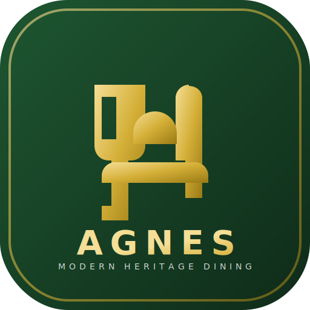

# Agnes Catering | Modern Heritage Dining

<div align="center">



**Exquisite Weddings, Timeless Flavors, and Bespoke Private Dining in Nairobi, Kenya.**

[](https://agnes-cutlery.vercel.app)
[](https://react.dev)
[](https://tailwindcss.com)
[](https://typescriptlang.org)

**[Live Site](https://agnes-cutlery.vercel.app)**

</div>

---

## Overview

Agnes Catering is a premier culinary service provider based in **Westlands, Nairobi**. The platform bridges traditional Kenyan heritage with contemporary fine dining aesthetics and white-glove hospitality.

This repository contains the complete source code for the production web platform — a single-page application with responsive cross-device design, glassmorphic UI, motion animations, WhatsApp direct integration, and PWA support.

---

## Features

| Category | Details |
|----------|---------|
| **PWA Support** | Installable on any device. Service worker with network-first HTML strategy. Manifest with SVG/PNG icons. |
| **WhatsApp Integration** | Direct booking on every page via pre-filled WhatsApp messages (+254 797 453 969). Quick-chat widget with one-tap options. |
| **Universal App Icon** | Text-free, shape-only design (bold gold "A" monogram on deep green). Recognizable from 16px favicon to 512px splash. |
| **Glassmorphism UI** | Frosted-glass nav, panels, and cards with backdrop-blur and ambient shadows. |
| **Motion Animations** | Page transitions, scroll-triggered fade-ins, floating elements, and glow pulses via Framer Motion. |
| **SEO & Meta** | React Helmet for per-page titles, descriptions, Open Graph, and JSON-LD structured data. |
| **Site Search** | Overlay search with instant results across all pages and services. |
| **Mobile-First** | Bottom navigation bar, slide-out drawer, and FABs on mobile. Full desktop nav on xl+. |
| **35 Curated Photos** | 19 authentic WhatsApp photos + 16 matched Unsplash images across 5 gallery categories. |
| **Accessible Colors** | WCAG-compliant contrast. Darkened gold (#8B6914) readable on all backgrounds. |

---

## Tech Stack

| Layer | Technology |
|-------|------------|
| **Framework** | React 19 + TypeScript 5.8 |
| **Build** | Vite 6.4 |
| **Styling** | Tailwind CSS v4 (CSS-first config with `@theme`) |
| **Routing** | React Router DOM v7 |
| **Animation** | Motion (Framer Motion v12) |
| **Icons** | Lucide React |
| **SEO** | React Helmet Async |
| **Utilities** | clsx + tailwind-merge |
| **Deployment** | Vercel (auto-deploy from `main` branch) |

---

## Project Structure

```text
agnes-cutlery/
├── public/                              # Static assets & PWA
│   ├── icon.svg                         # Universal SVG logo (bold "A" monogram)
│   ├── icon-192.png                     # PWA icon 192x192
│   ├── icon-512.png                     # PWA splash icon 512x512
│   ├── apple-touch-icon.png             # iOS home screen icon 180x180
│   ├── favicon.ico                      # Multi-resolution favicon (16/32/48px)
│   ├── manifest.json                    # PWA manifest
│   └── sw.js                            # Service worker (network-first HTML, cache-first assets)
│
├── src/
│   ├── assets/images/                   # 19 authentic WhatsApp photos
│   │
│   ├── components/
│   │   ├── HeroCarousel.tsx             # 4-slide hero with food/chef/wedding images
│   │   ├── Layout.tsx                   # Header, footer, mobile drawer, bottom nav, FABs
│   │   ├── PageTransition.tsx           # Motion fade/slide page transitions
│   │   ├── QuickChat.tsx                # WhatsApp quick-chat widget with preset options
│   │   ├── SearchBar.tsx                # Site-wide search overlay
│   │   ├── SEO.tsx                      # Helmet-based per-page SEO + JSON-LD
│   │   ├── Testimonials.tsx             # Customer testimonial cards
│   │   └── ReservationForm.tsx          # Event reservation form
│   │
│   ├── pages/
│   │   ├── Home.tsx                     # Hero + Why Choose Us + About + Services + Gallery + Testimonials + CTA
│   │   ├── About.tsx                    # Story + 4 core values
│   │   ├── Services.tsx                 # 10 services with local WhatsApp images
│   │   ├── Menu.tsx                     # 24 menu items across 5 categories with matched photos
│   │   ├── Gallery.tsx                  # 35 images across 5 filterable categories (masonry grid)
│   │   ├── Weddings.tsx                 # 3 wedding packages with pricing + CTA
│   │   ├── PrivateChef.tsx              # Bespoke dining with bento grid layout
│   │   ├── FAQ.tsx                      # 7 accordion FAQs + WhatsApp CTA
│   │   ├── TestimonialsPage.tsx         # Full testimonials page
│   │   └── Contact.tsx                  # Contact form + info + map
│   │
│   ├── lib/
│   │   └── utils.ts                     # cn() utility (clsx + tailwind-merge)
│   │
│   ├── App.tsx                          # Animated route definitions
│   ├── index.css                        # Theme tokens, glassmorphism, animations, color utilities
│   └── main.tsx                         # React entry point with HelmetProvider
│
├── index.html                           # HTML shell with PWA meta tags + SW registration
├── vercel.json                          # SPA rewrite rules + asset caching headers
├── vite.config.ts                       # Vite + React + Tailwind plugins
├── tsconfig.json                        # TypeScript configuration
├── package.json                         # Dependencies & scripts
└── README.md                            # This file
```

---

## Pages (10 routes)

| Route | Page | Description |
|-------|------|-------------|
| `/` | Home | Hero carousel, why choose us, featured services, gallery preview, testimonials, CTA |
| `/about` | About | Brand story, mission, 4 core values |
| `/services` | Services | 10 catering services with WhatsApp images |
| `/menu` | Menu | 24 dishes in 5 categories (Kenyan, International, Breakfast, Desserts, Drinks) |
| `/gallery` | Gallery | 35 photos, 5 filterable categories, masonry grid |
| `/weddings` | Weddings | 3 wedding packages with pricing tiers |
| `/private-chef` | Private Chef | Bespoke in-home dining with bento layout |
| `/testimonials` | Testimonials | Customer reviews and feedback |
| `/faq` | FAQ | 7 expandable questions + WhatsApp CTA |
| `/contact` | Contact | Contact form, phone, email, location |

---

## Design System

### Color Palette

| Token | Hex | Usage |
|-------|-----|-------|
| `primary` | `#143A20` | Deep forest green — backgrounds, buttons, header |
| `secondary` | `#8B6914` | Rich gold — accents, labels, borders (WCAG compliant) |
| `tertiary` | `#A04000` | Terracotta — alerts, highlights |
| `background` | `#FAF9F6` | Warm off-white — page background |
| `surface` | `#FFFFFF` | Cards, panels |
| `on-surface` | `#1A1A1A` | Body text |

### Typography

| Family | Weight | Usage |
|--------|--------|-------|
| **Playfair Display** | 400-700 | Display headings, brand name |
| **Inter** | 400-600 | Body text, labels, UI elements |

### Icon System

The universal app icon is a **text-free, shape-only** design:
- **Deep green rounded square** (rx=108) background
- **Bold gold "A" monogram** — geometric, centered
- **Fork/crown tines** — 3 prongs at the apex (culinary motif, visible at 64px+)
- **Plate arc** — subtle curve beneath the A

Generated assets for every context: SVG (scalable), PNG (192/512), ICO (16/32/48), Apple Touch (180).

---

## Getting Started

### Prerequisites

- Node.js v18+
- npm (or bun)

### Install & Run

```bash
# Clone
git clone https://github.com/ismahdeismail-beep/agnes-cutlery.git
cd agnes-cutlery

# Install
npm install

# Development
npm run dev

# Production build
npm run build

# Preview production build
npm run preview

# Type check
npm run lint
```

The dev server runs at `http://localhost:3000`.

---

## Deployment

The project deploys automatically to **Vercel** on every push to `main`.

### Key Configuration

- **`vercel.json`**: SPA rewrites (`/* → /index.html`) so client-side routing works on all paths. Static assets served with immutable cache headers.
- **Service Worker** (`public/sw.js`): Network-first strategy for HTML navigation requests (prevents stale cached pages after deployment). Cache-first for JS/CSS/images (performance).

### If Deploying Manually

```bash
npm run build
# Upload the dist/ folder to any static host
```

---

## Image Assets

| Source | Count | Usage |
|--------|-------|-------|
| **WhatsApp photos** | 19 | Authentic event and dish photos from real Agnes Catering events |
| **Unsplash (curated)** | 16 | Matched food/chef/wedding images for visual variety |
| **Total in gallery** | 35 | Filterable by Buffet, Wedding, Corporate, Private Chef |

All WhatsApp photos are stored locally in `src/assets/images/` as Vite-processed imports. Unsplash images use direct URLs with auto-format optimization.

---

## Service Worker Strategy

| Request Type | Strategy | Rationale |
|-------------|----------|-----------|
| **Navigation (HTML)** | Network-first | Prevents stale `index.html` serving deleted JS/CSS bundles |
| **Static assets (JS/CSS/images)** | Cache-first | Fast loading, content-hashed filenames ensure freshness |
| **Cache version** | `agnes-v2` | Bumped from v1 to clear stale caches after icon/routing fixes |

---

## Contact & Bookings

| Channel | Details |
|---------|---------|
| **Location** | Westlands, Nairobi, Kenya |
| **Phone / WhatsApp** | [+254 797 453 969](https://wa.me/254797453969) |
| **Email** | [karreyaggie@gmail.com](mailto:karreyaggie@gmail.com) |
| **Hours** | Mon-Fri: 8AM-8PM · Sat: 9AM-6PM · Sun: 10AM-4PM |

---

## License

© 2026 Agnes Catering. All rights reserved.
